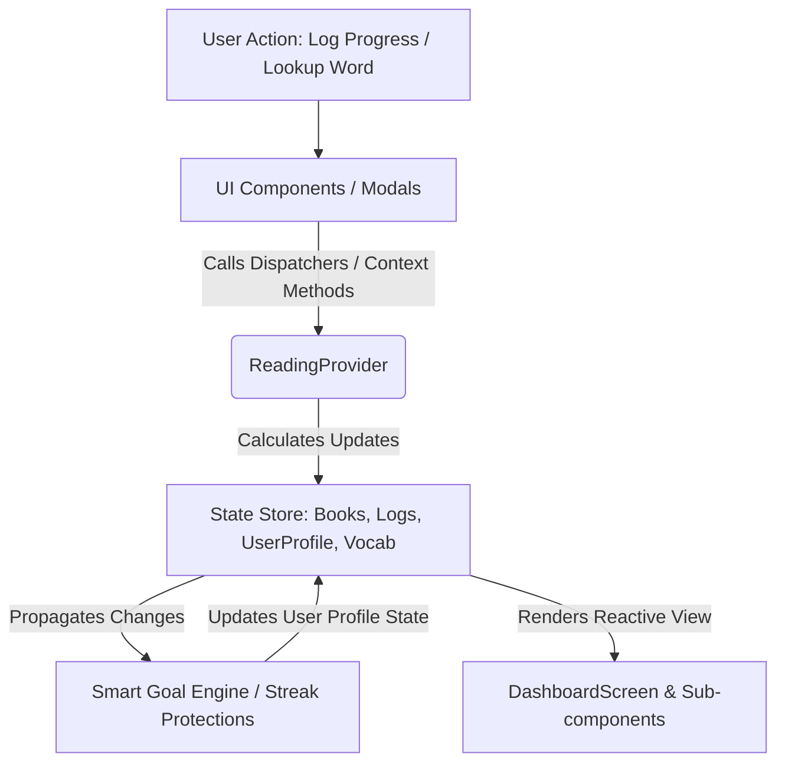

# 📚 EasyReads - Mindful Reading Companion

EasyReads is a premium, mindful reading companion built with **React Native** and **Expo (SDK 56)**. It combines intelligent habit tracking with real-time dictionary lookup to enhance your reading experience. The app features dynamic goal adjustment based on your reading velocity, streak protection, and milestone celebrations.

This project implements a complete reading engine that models user behavior, automatically adjusts goals based on reading velocity, protects daily habits using streak freeze tokens, and celebrates major milestones.

---

## 📖 Table of Contents
1. [System Architecture & Data Flow](#-system-architecture--data-flow)
2. [Core Engines: Under the Hood](#-core-engines-under-the-hood)
3. [Key Features](#-key-features)
4. [Project Structure](#-project-structure)
5. [Code & File Reference](#-code--file-reference)
6. [Data Models & TypeScript Interfaces](#-data-models--typescript-interfaces)
7. [Getting Started & Installation](#-getting-started--installation)
8. [Firebase Backend Setup](#-firebase-backend-setup)
9. [Simulation & Testing Workflows](#-simulation--testing-workflows)

---

## 🏗️ System Architecture & Data Flow

EasyReads operates on a unidirectional data flow powered by the **React Context API** (`ReadingContext`). The application state resides at the root level, making it easy to simulate data changes, persist updates, and trigger modal views across the UI.



### Key Architectural Pillars
- **Single Source of Truth**: The `ReadingProvider` wraps the entire app, exposing state (`user`, `books`, `logs`, `vocabNotebook`, etc.) and mutation methods to all components.
- **Pure Functional Helpers**: Computational logic, badge calculations, and list filtering are isolated in `utils/bookHelpers.ts` to keep the context provider clean and testable.
- **Dynamic Theming System**: Located in `constants/theme.ts`, utilizing a warm paper cream and deep ink blue palette to mimic physical books.

---

## ⚙️ Core Engines: Under the Hood

### 1. The Smart Goal Engine
Traditional habit trackers penalize users for falling behind, causing "streak fatigue" or abandonment. EasyReads uses a **Smart Goal Engine** that adjusts to the reader's real-time velocity.

*   **Baseline Goal**: The user's target reading quantity (default is `15` pages/day).
*   **Trigger Condition**: If the user logs pages read below their baseline goal for **3 consecutive days**, the engine scales down the daily target.
*   **Formula**:
    $$\text{Adjusted Goal} = \text{Baseline} - (\text{Baseline} - \text{3-Day Average}) \times 0.2$$
    *(Rounded to the nearest page, with a minimum fallback of 1 page).*
*   **Restoration**: If the user logs a single day at or above their original baseline, the engine immediately restores the goal to the baseline value.

### 2. Habit Streak & Streak Freeze Protection
To prevent demotivation when a day is missed, EasyReads implements a streak protection protocol:
*   **Streak Freeze Tokens**: The user starts with a maximum of `2` tokens.
*   **Automatic Protection**: If a reading day is skipped (simulated or actual), a token is consumed to keep the streak intact.
*   **Notification Banner**: A light-green banner notifies the user that their streak was protected yesterday.
*   **Streak Reset**: If no freeze tokens remain and a day is skipped, the streak resets to `0`.

### 3. Rolling Page Average & Estimation Engine
*   **Rolling Average**: Calculates the average pages read per day over active reading days in the last 5 days.
*   **Estimated Completion Date**: Uses the active book's remaining pages divided by the user's `rollingPageAverage` to calculate the exact calendar date the user will finish the book.

---

## ✨ Key Features

*   **📖 Active Book Tracker**: Manages multiple books in progress, page-by-page progress bars, and estimated completion dates.
*   **🎨 Custom Reading Heatmaps**: Visualizes progress using page markers where the user logged progress or saved words.
*   **🔍 Quick Dictionary Lookup**: Searches words in real-time using the *Free Dictionary API*, falling back to a local offline dictionary if offline. Features:
    *   **Smart AI animations**: Lottie sparkle effects for thinking/typing moments
    *   **Google Gemini feel**: Staggered reveal (30ms cascade) for smooth UI
    *   Lottie bookmark animation for save/unsave word actions
    *   Swipe-to-dismiss for result cards
*   **🏆 Pehla Kitaab (First Book Certificate)**: An elegant digital certificate with gold corner ornaments and a mindful reading quote that displays immediately when the user completes their first-ever book.
*   **🎨 Social Share Card Generator**: Generates high-fidelity shareable gold-trimmed quote cards with looked-up words, their definitions, page numbers, and parent book titles.
*   **⚙️ Interactive Developer Panel**: An expandable controls drawer to simulate edge-case scenarios like skipping a day, logging 3 low entries, or resetting state.

---

## 📂 Project Structure

```text
easyread/
├── assets/                    # App icons, splash screens, and adaptive assets
├── components/                # Reusable UI components & modals
│   ├── CelebrationModal.tsx        # Pehla Kitaab full-screen completion certificate
│   ├── SimulationControls.tsx      # Developer simulator drawer (skip day, low logs)
│   ├── UpdateProgressModal.tsx     # Sliding progress logger sheet
│   └── VocabLookupModal.tsx        # Dictionary Search, local dictionary & share cards
├── config/
│   └── firebase.ts            # Firebase JS SDK initialization (Expo Go compatible)
├── services/
│   └── firebase/              # Auth + Firestore read/write for reading data
├── constants/
│   └── theme.ts               # Global design tokens (colors, spacings, fonts)
├── context/
│   └── ReadingContext.tsx     # State store, Smart Goal Engine, and Streak Freeze logic
├── navigation/                # Navigation configurations
├── screens/
│   └── DashboardScreen.tsx    # Main user dashboard containing all UI sub-panels
├── utils/
│   └── bookHelpers.ts         # Math helpers (rolling averages, badges, filter functions)
├── App.tsx                    # Root component wrapping state provider
├── app.json                   # Expo configuration metadata
├── index.ts                   # Application entry point
├── package.json               # Native modules and configuration scripts
└── tsconfig.json              # TypeScript compilation rules
```

---

## 💻 Code & File Reference

### 1. Core State Provider: `context/ReadingContext.tsx`
This file is the nervous system of the application.
*   **`ReadingProvider`**: Manages state arrays for `books`, `logs`, `vocabNotebook`, and flags for simulation.
*   **`updateProgress(bookId, newPage)`**: Updates pages read for a book. If pages read equals total pages, it flags the book as completed and triggers the `Pehla Kitaab` celebration. It also updates daily log history, updates the rolling page speed average, and executes the Smart Goal recalculation check.
*   **`simulateSkipDay()`**: Simulates a missed reading day. Decrements a streak freeze token if available to save the streak, otherwise resets the streak.
*   **`simulateThreeLowEntries()`**: Artificially injects 3 low-progress log entries into history, triggering the Smart Goal Engine to scale down the current goal.

### 2. Math & Visual Helpers: `utils/bookHelpers.ts`
*   **`getBookBadges(book, logs, vocab)`**: Calculates earned achievements on a per-book basis. Badges include:
    *   *Finished* (Book completed)
    *   *Halfway* (Read $\ge$ 50% of the book)
    *   *7-Day Reader* (Logged reading for $\ge$ 7 distinct days)
    *   *Speed Reader* (Logged $\ge$ 20 pages in a single log)
    *   *Word Collector* (Looked up & saved $\ge$ 5 words during this book)
    *   *Marathon* (Read $\ge$ 300 pages total in the book)
    *   *New Arrival* (Added within the last 7 days)
*   **`filterBooks(books, filter, logs, vocab)`**: Filters the library view by category (`all`, `reading`, `completed`, `new`, `badges`).

### 3. UI Component Sheets: `components/`
*   **`UpdateProgressModal.tsx`**: Bottom sheet modal allowing users to log page numbers, protecting against out-of-bound errors and retrogressions.
*   **`InlineDictionarySearch.tsx`**: Real-time dictionary search component featuring:
    *   **AI Thinking Indicator**: Lottie `Sparkles Loop Loader ai.json` animation plays once when results appear
    *   **Google Gemini Feel**: Staggered reveal (30ms cascade) with title → definition → example → synonyms
    *   **Bookmark Animation**: Lottie `save.json` animation for save/unsave word action
    *   **Responsive UI**: Smooth search bar expansion, swipe-to-dismiss on result card
*   **`VocabLookupModal.tsx`**: Contains the dictionary search logic. Includes a custom, styled canvas-like card generator displaying a dictionary card with ornate styling that can be screenshotted or shared.
*   **`CelebrationModal.tsx`**: Full-screen modal that shows a classical certificate styling for `PEHLA KITAAB` with custom border coordinates.
*   **`SimulationControls.tsx`**: Renders three options for debugging context engines synchronously.

---

## 🗃️ Data Models & TypeScript Interfaces

EasyReads is strictly typed to prevent state mutation bugs. Here are the core data models:

### `Book`
Represents a literary volume in the database.
```typescript
interface Book {
  bookId: string;
  title: string;
  author: string;
  totalPages: number;
  pagesRead: number;
  status: 'reading' | 'completed';
  startedAt: string;
  completedAt?: string;
  coverUrl?: string;
  isBookmarked?: boolean;
}
```

### `ProgressLog`
Represents daily progress logs (delta calculations).
```typescript
interface ProgressLog {
  id: string;
  bookId: string;
  dateString: string; // YYYY-MM-DD
  pagesReadDelta: number; // Pages read during this entry
}
```

### `UserProfile`
Tracks user statistics, goals, and streak items.
```typescript
interface UserProfile {
  uid: string;
  displayName: string;
  email: string;
  createdAt: string;
  currentStreak: number;
  streakFreezeAvailable: number; // Maximum value: 3
  rollingPageAverage: number;    // Calculated rolling page speed
  baselineGoal: number;          // Original standard goal
  currentGoal: number;           // Dynamically scaled goal
}
```

### `DefinitionResult`
Represents vocabulary items saved in the user's notebook.
```typescript
interface DefinitionResult {
  word: string;
  phonetic?: string;
  definition: string;
  partOfSpeech: string;
  audioUrl?: string;
  bookId?: string;       // Context: book being read when discovered
  bookTitle?: string;    // Context title
  pageLearned?: number;  // Page location
  dateLearned?: string;
}
```

---

## 🚀 Getting Started & Installation

### Prerequisites
Make sure you have Node.js and the Expo CLI installed.

### 1. Install Dependencies
Clone the repository, navigate to the folder, and run:
```bash
npm install
```

### 2. Run the Metro Bundler
Start the development server:
```bash
npm start
```

### 3. Deploy to Client Device / Emulator
*   **Expo Go**: Scan the Metro bundler QR code using your physical device's camera (iOS) or the Expo Go application (Android).
*   **Android Simulator**: Press `a` in the terminal to launch on an active Android Virtual Device (AVD).
*   **iOS Simulator**: Press `i` in the terminal to launch on Xcode's simulator.

---

## 🔥 Firebase Backend Setup

EasyRead uses the **Firebase JS SDK** (v12+) so it works in **Expo Go** without custom native code. When configured, reading data syncs to **Cloud Firestore** under the signed-in user's UID. Without config, the app falls back to local demo data.

### 1. Create a Firebase project

1. Go to [Firebase Console](https://console.firebase.google.com/) and create a project (or use an existing one).
2. Add a **Web app** (Project settings → Your apps → Web `</>`).
3. Copy the `firebaseConfig` object values.

### 2. Enable Authentication & Firestore

1. **Authentication** → Sign-in method → enable **Anonymous** (simplest; no UI required).
2. **Firestore Database** → Create database (start in test mode for development, then lock down with rules below).

### 3. Configure the app

```bash
cp .env.example .env
```

Fill in your Firebase web config keys in `.env`:

```env
EXPO_PUBLIC_FIREBASE_API_KEY=...
EXPO_PUBLIC_FIREBASE_AUTH_DOMAIN=...
EXPO_PUBLIC_FIREBASE_PROJECT_ID=...
EXPO_PUBLIC_FIREBASE_STORAGE_BUCKET=...
EXPO_PUBLIC_FIREBASE_MESSAGING_SENDER_ID=...
EXPO_PUBLIC_FIREBASE_APP_ID=...
```

Restart the Metro bundler after changing `.env`:

```bash
npm start
```

> **Never commit `.env`** — it is listed in `.gitignore`. Only `.env.example` with placeholders is tracked.

### 4. Firestore schema

All data is scoped under the authenticated user's UID:

| Path | Document | Contents |
|------|----------|----------|
| `users/{uid}` | User profile | Streaks, XP, level, goals, achievements, totals |
| `users/{uid}/books/{bookId}` | Book | Title, author, pages, status, cover, per-book achievements |
| `users/{uid}/logs/{logId}` | Progress log | Daily page deltas per book |
| `users/{uid}/vocab/{wordId}` | Vocab entry | Saved dictionary words + mastery metadata |
| `users/{uid}/meta/app` | App meta | `currentBookId`, `readingMarkers` |

`bookReadLog` is derived from logs on load and is not stored separately.

### 5. Recommended Firestore security rules

Replace test-mode rules before shipping:

```
rules_version = '2';
service cloud.firestore {
  match /databases/{database}/documents {
    match /users/{userId} {
      allow read, write: if request.auth != null && request.auth.uid == userId;

      match /books/{bookId} {
        allow read, write: if request.auth != null && request.auth.uid == userId;
      }
      match /logs/{logId} {
        allow read, write: if request.auth != null && request.auth.uid == userId;
      }
      match /vocab/{wordId} {
        allow read, write: if request.auth != null && request.auth.uid == userId;
      }
      match /meta/{docId} {
        allow read, write: if request.auth != null && request.auth.uid == userId;
      }
    }
  }
}
```

### 6. Offline behavior

- **Web**: Firestore uses persistent IndexedDB cache.
- **iOS / Android (Expo Go)**: In-memory cache only — writes queue while online during a session; for durable native offline persistence, migrate to `@react-native-firebase/*` with a development build.

### Auth approach

**Anonymous authentication** signs the user in automatically on first launch and persists the session via AsyncStorage. No login UI is required. Each device gets its own anonymous UID; link accounts later with Firebase Auth if you add email/social sign-in.

---

## 🧪 Simulation & Testing Workflows

Use the built-in control panel at the bottom of the dashboard screen to verify and debug the engines:

1.  **Streak Protection (Skip Day)**:
    *   Click **Simulate Skip Day**.
    *   Observe if your streak freeze token count decrements (e.g., from `2` to `1`).
    *   A notification banner stating *"Your streak was protected yesterday"* will appear at the top of the dashboard.
    *   Click it again to consume the last token.
    *   A third click will reset the current streak to `0` since no tokens are left.
2.  **Smart Goal scaling (Log 3 Low Entries)**:
    *   Click **Simulate 3 Low Entries**.
    *   The app will inject three consecutive logs below the baseline (e.g., 3, 2, 4 pages).
    *   The daily goal badge on the dashboard will dynamically drop from the baseline (e.g., `15`) to the adjusted goal (e.g., `13`).
3.  **Reset Simulation**:
    *   Click **Reset Simulation State** to restore all mock books, user records, and progress history back to their initial values.


